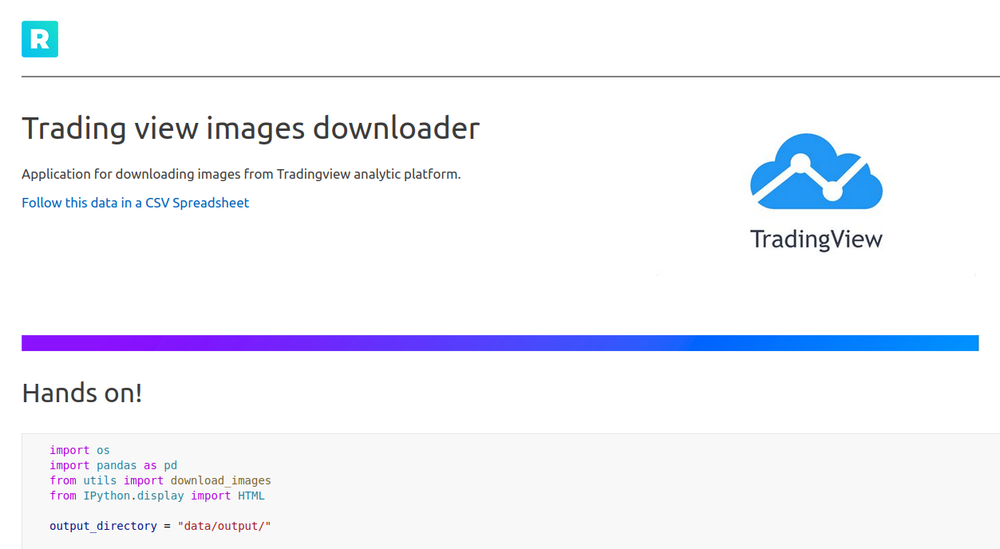
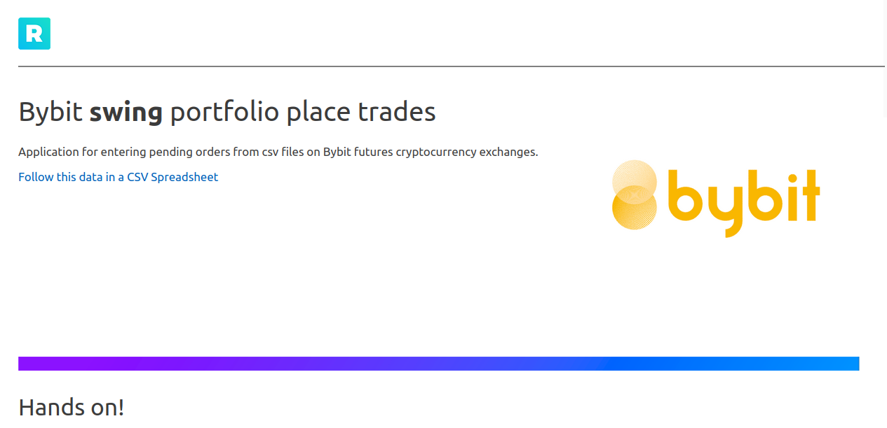

# trading-notebooks
The repository contains jupyter notebooks with trading content.

## List of notebooks
* TradingViewImagesDownloader
* PlaceTradesBybit

## Installation
```commandline
make clean
make prepare
```

## Usage
**Run job**
```commandline
make-run
```

## Examples

### TradingViewImageDownloader


### PlaceTradesBybit



## Contributors
<!-- ALL-CONTRIBUTORS-LIST:START - Do not remove or modify this section -->
<!-- prettier-ignore-start -->
<!-- markdownlint-disable -->
<table>
  <tr>
     <td align="center"><a href="https://github.com/GeorgeFreelanceDeveloper"><br /><sub><b>GeorgeFreelanceDeveloper</b></sub></a><br /><a href="https://github.com/GeorgeFreelanceDeveloper" title="Ideas">🤔</a></td>
    <td align="center"><a href="https://github.com/LucyFreelanceDeveloper"><br /><sub><b>LucyFreelanceDeveloper</b></sub></a><br /><a href="https://github.com/LucyFreelanceDeveloper" title="Code">💻</a></td>
  </tr>
</table>
~             
